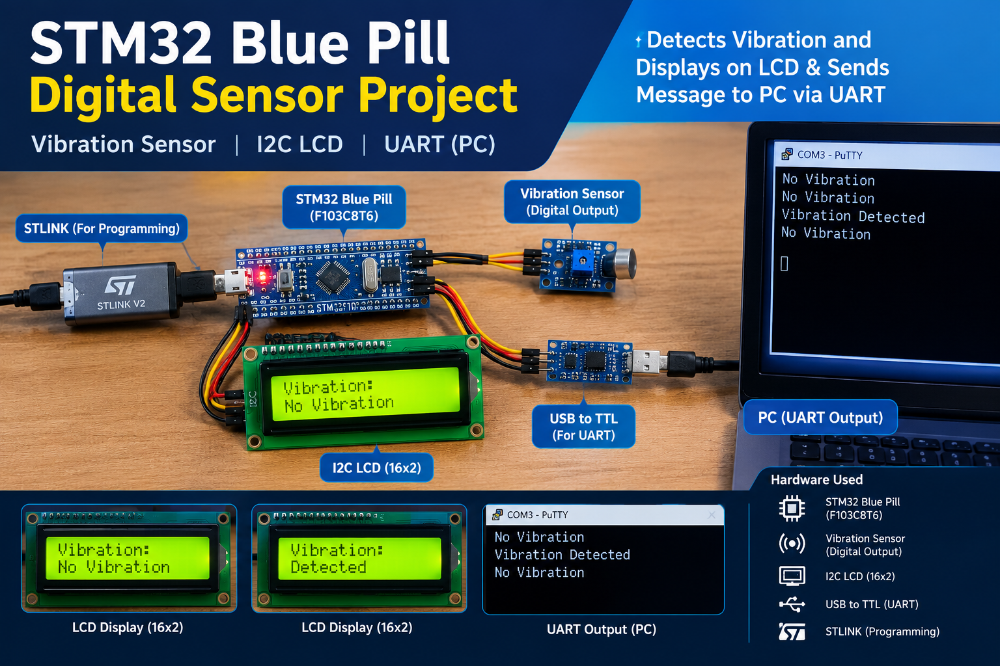
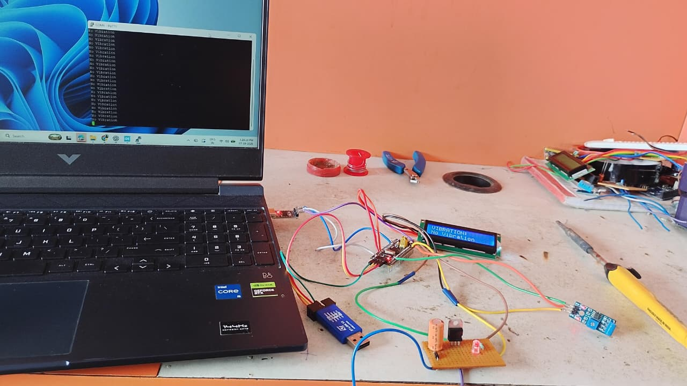

# STM32 Digital Sensor Interfacing Using Bare-Metal C

## Project Overview

This project demonstrates digital vibration sensor interfacing with the STM32F103C8T6 Blue Pill using bare-metal C programming and direct register-level programming.

The STM32 reads the digital output of a vibration sensor. When vibration is detected, the status is displayed on a 16x2 I2C LCD and transmitted to a PC through UART using a USB-to-TTL converter.

## Project Thumbnail




## Hardware Used

* STM32F103C8T6 Blue Pill
* Digital Vibration Sensor Module
* 16x2 LCD with I2C interface
* ST-LINK V2 programmer/debugger
* USB-to-TTL converter
* USB cable and jumper wires
* PC for UART serial monitoring

## Hardware Setup



## Project Features

* Reads the digital output of a vibration sensor using STM32 GPIO.
* Displays vibration status on a 16x2 I2C LCD.
* Transmits sensor status to a PC using USART1.
* Uses ST-LINK V2 for programming the STM32.
* Implements peripheral configuration through direct register access.

## Working Principle

1. The STM32F103C8T6 reads the digital output from the vibration sensor.
2. When vibration is detected, the LCD displays **Detected**.
3. When no vibration is detected, the LCD displays **No Vibration**.
4. The same status message is transmitted to the PC through UART.
5. The USB-to-TTL converter provides the serial communication connection between the STM32 and the PC.

## Software and Tools

* Language: C
* Programming approach: Bare-metal C / Register-level programming
* IDE: STM32CubeIDE
* Programming tool: ST-LINK V2
* Serial monitoring: PuTTY
* Version control: Git and GitHub

## Communication Interfaces

| Interface     | Purpose                                   |
| ------------- | ----------------------------------------- |
| GPIO          | Reads the digital vibration sensor output |
| I2C           | Communicates with the LCD                 |
| USART1 / UART | Sends vibration status to the PC          |
| ST-LINK       | Programs and debugs the STM32             |

## UART Output

Example serial monitor output:

```text
No Vibration
No Vibration
Vibration Detected
No Vibration
Vibration Detected
```

## Skills Demonstrated

* Embedded C programming
* STM32F103C8T6 microcontroller
* Bare-metal register-level programming
* GPIO digital input
* I2C LCD interfacing
* USART1 UART communication
* Peripheral clock configuration
* Microcontroller programming using ST-LINK
* Serial debugging using PuTTY

## Project Structure

```text
Digital_sensor/
├── Images/
│   ├── thumbnail.png
│   └── Hardware.png
├── Inc/
├── Src/
├── Startup/
└── README.md
```


## Author

**K Sabari**

GitHub: [sabarikumar2004](https://github.com/sabarikumar2004)
